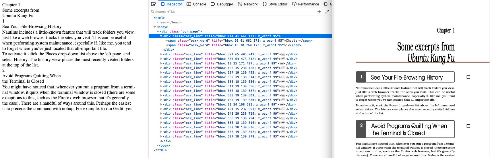

# Amazon-Textract-hOCR
Convert your Amazon Textract results to hOCR output. 

**[08/2021]** Currently available for single page operations. PNG/JPG files allowed. 

### Next implementations:
- Multi-page operations
- Form, Tables and Expenses operations

### Usage Instructions

- Download the **single-page.py** file located in the code folder.
- Configure your **aws cli** credentials and region.
- Install the [yattag](https://www.yattag.org/download-install) package (used for HTML generation)
- Inside **single-page.py**, in the main function, replace the *bucket* and *filename* with your own location. Remember to use PNG or JPG files located in your Amazon S3 bucket.
- Run the script, it will generate an output.html file

### Output example

